

  <picture>
    <source media="(max-width: 600px)" srcset="./assets/hero-mobile.svg" />
    
  </picture>

  
  <a href="https://instagram.com/deep_golakiya_1">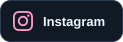</a>
  
  

## A little about me

I'm **Deep Golakiya**, an Android developer at **D-Tech Infotech**. I enjoy turning ideas into practical apps with **Java and Kotlin**—and learning something new along the way.

- **Building:** RE Inventory and a manual for testing & installation.
- **Learning:** Flutter and HMI.
- **Collaborating:** Android apps and useful developer projects.
- **Ask me about:** Android, Java, Kotlin, or a problem we can research together.

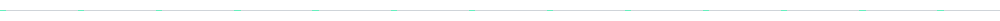

## Projects from my workspace

  <a href="https://github.com/deepbajud/D-Chat">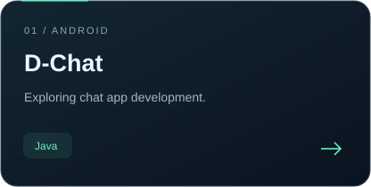</a>
  <a href="https://github.com/deepbajud/Note_Pro_App">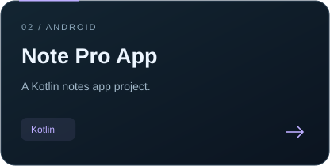</a>
  <a href="https://github.com/deepbajud/Retrofit_Api">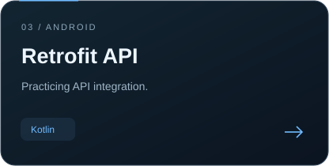</a>

<a href="https://github.com/deepbajud?tab=repositories"><strong>Explore all my repositories →</strong></a>

## My toolkit

**Android development**

  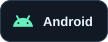
  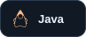
  
  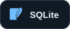

**Tools I work with**

  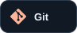
  
  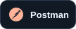
  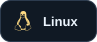
  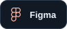
  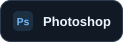
  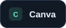

**Currently exploring**

  
  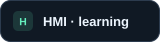

<strong>More languages & creative tools</strong>

 

  
  
  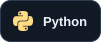
  
  
  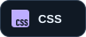
  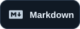
  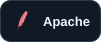
  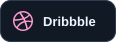

## Progress, one contribution at a time

  <picture>
    <source media="(max-width: 600px)" srcset="./assets/stats-mobile.svg" />
    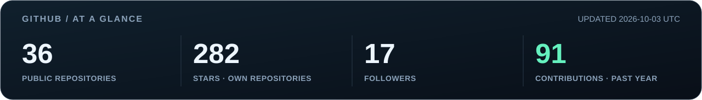
  </picture>

  <a href="https://github.com/deepbajud?tab=overview">
    <picture>
      <source media="(max-width: 600px)" srcset="./assets/contribution-city-mobile.svg" />
      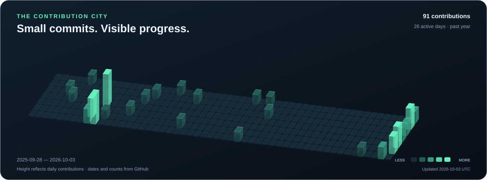
    </picture>
  </a>

<strong>Open the contribution calendar</strong>

 
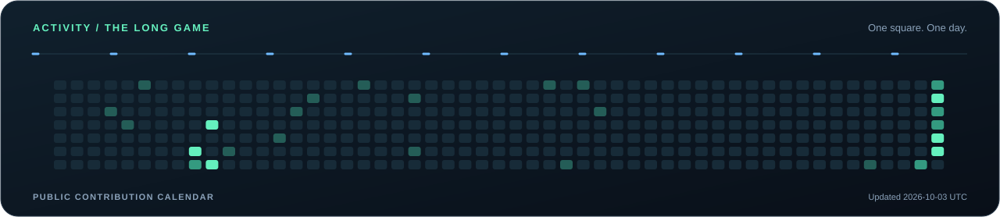

Based on public GitHub data. The cards show their last update date.

## Find me around the web

  <a href="https://behance.net/deepbajud">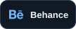</a>
  <a href="https://medium.com/@dbajud">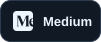</a>
  <a href="https://stackoverflow.com/users/21010520">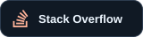</a>
  <a href="https://codepen.io/deepbajud">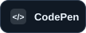</a>
  <a href="https://app.daily.dev/deepbajud"><strong>daily.dev ↗</strong></a>

<strong>More places to connect</strong>

 

  
  <a href="https://pinterest.com/deepbajud">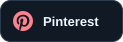</a>
  
  <a href="https://reddit.com/user/deepbajud">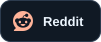</a>

## Support my work

If something I've built helps you, a little support means a lot.

  <a href="https://ko-fi.com/deepgolakiya">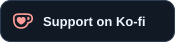</a>
  <a href="https://buymeacoffee.com/dbajud">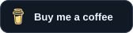</a>

Other ways to support

 

  
  

 

  <a href="https://linkedin.com/in/deep-golakiya-255bb2261">
    <picture>
      <source media="(max-width: 600px)" srcset="./assets/footer-mobile.svg" />
      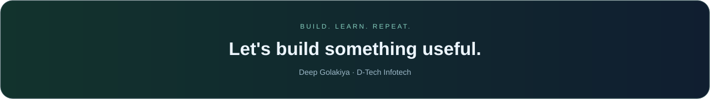
    </picture>
  </a>

